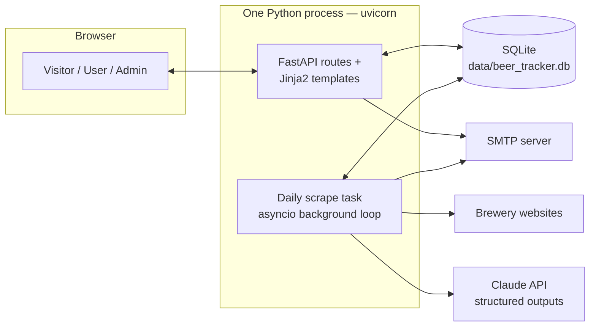
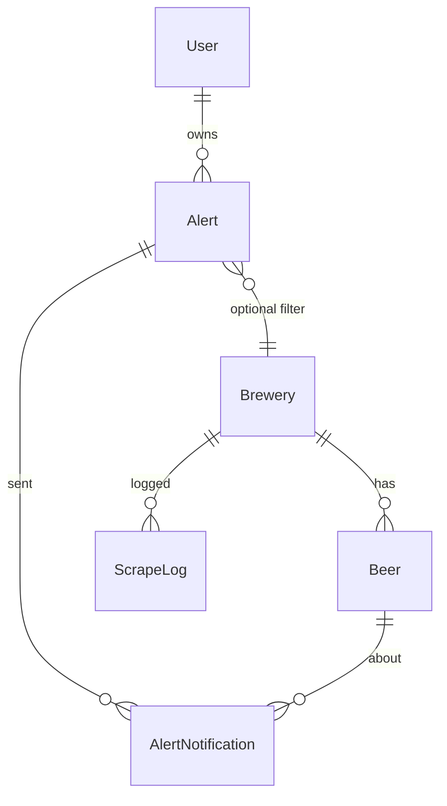

# Architecture

How East Bay Beer Tracker is designed: components, data model, and the three
core flows (browsing, authentication/alerts, and scraping).

## Overview

The app is a single Python process: a FastAPI web server that renders
server-side Jinja2 templates, backed by a SQLite database, with a scraping
job that runs inside the same process on a daily schedule. There is no
JavaScript framework, no separate worker queue, and no external database —
the design goal is a self-contained service that one small VPS can run.

## Code layout

| File | Responsibility |
|---|---|
| `app/main.py` | FastAPI app: all routes (public, auth, alerts, admin), the daily-scrape scheduler, app lifespan (DB init + seeding) |
| `app/db.py` | SQLAlchemy models, engine/session setup, first-boot brewery seeding |
| `app/auth.py` | Email-code (passwordless) login, signed-cookie sessions, admin check |
| `app/scraper.py` | Fetch → HTML-to-text → LLM parse → upsert → alert matching/notification |
| `app/emailer.py` | SMTP sending with a log-only dev fallback |
| `app/config.py` | All configuration from environment variables; secret-key persistence |
| `app/templates/`, `app/static/` | Server-rendered pages and the single stylesheet |

## Data model

- **Brewery** — name, location, website, and `scrape_urls` (one URL per line;
  these are the pages the daily scraper reads). `is_active` controls whether
  it's included in scrapes. The admin panel is the CRUD surface for this table.
- **Beer** — belongs to a brewery. Fields extracted by the LLM: name, style,
  ABV, description, availability, and `style_family` — one of ~11 canonical
  families (see `app/styles.py`) assigned by the LLM at scrape time, with a
  keyword classifier as fallback/backfill; the family drives the style filter
  checkboxes. Lifecycle fields: `first_seen`, `last_seen`,
  and `is_current` (set false when a beer disappears from the brewery's page —
  it is retired, never deleted, so history is preserved). Each beer has a
  detail page at `/beers/{id}` showing its description and first/last-seen
  history.
- **User** — just an email address. Created on first successful sign-in.
- **LoginCode** — hashed one-time codes with expiry, attempt counter, and a
  used flag. Codes are never stored in plaintext.
- **Alert** — a user's saved conditions: keyword, brewery, style substring,
  min/max ABV. All *filled-in* conditions must match (AND semantics). Can be
  paused (`is_active`).
- **AlertNotification** — records each (alert, beer) pair already emailed, so
  a user is never notified twice about the same beer.
- **SourcePage** — per (brewery, URL) cache: the SHA-256 hash of the last
  page text and the JSON beer list parsed from it. Lets an unchanged page
  skip the LLM call entirely (see the scraping pipeline below).
- **ScrapeLog** — one row per brewery per scrape run: status (`ok` /
  `partial` / `warning` / `error`), beers found, new beers, detail (errors,
  or a note when pages were served from cache). Shown in the admin panel.

## Authentication design

Passwordless by construction — there are no password fields anywhere.

1. User submits their email at `/login`. The server generates a random
   6-digit code, stores only a salted SHA-256 hash of it (keyed with the
   server secret), invalidates any outstanding codes for that email, and
   emails the code.
2. User submits the code. Verification is constant-time
   (`hmac.compare_digest`), limited to 5 attempts, and codes expire after
   10 minutes and are single-use.
3. On success the server sets a session cookie: an
   [itsdangerous](https://itsdangerous.palletsprojects.com)-signed token
   containing the email, valid 30 days, `HttpOnly` + `SameSite=Lax`. No
   session table — the signature is the proof.

**Admin** is not a role stored in the database: a session is admin if and only
if its email equals `ADMIN_EMAIL` (default `andrewsunhwang@gmail.com`). The
admin normally signs in through the exact same email-code flow; there is no
separate admin credential to leak. All `/admin` routes re-check this on every
request, and the Admin nav link renders only for that session.

Optionally, setting `ADMIN_PASSWORD` (a host/deploy-platform secret — never
committed to the repo) enables a second entry point, `/admin/login`, where the
admin can sign in with that password instead of an emailed code. This exists
purely as a fallback for when outbound email isn't configured or working; the
comparison is constant-time (`hmac.compare_digest`) and a successful password
login sets exactly the same signed session cookie as the email flow — from
the app's perspective there's no distinction afterward. Leaving
`ADMIN_PASSWORD` unset disables this path entirely and `/admin/login`
redirects back to the normal email sign-in.

The signing secret comes from `SECRET_KEY` if set, otherwise it's generated
once and persisted to `data/.secret_key` so sessions survive restarts.

## Scraping pipeline

Runs daily at `SCRAPE_HOUR` (default 04:00 server time) via an asyncio
background task started in the FastAPI lifespan, and on demand from the admin
panel ("Scrape now" per brewery, or "Scrape all"). Admin-triggered scrapes run
as FastAPI background tasks so the request returns immediately.

Per active brewery, for each of its scrape URLs:

1. **Fetch** (`httpx`, browser-like User-Agent, redirects followed, 30 s
   timeout).
2. **Reduce to text**: BeautifulSoup collapses the page to readable text
   (scripts/styles/svg stripped, whitespace collapsed, capped at
   `SCRAPE_TEXT_LIMIT` = 80k chars). **Before** stripping scripts, it also
   harvests any beer data embedded as JSON in `<script>` tags — JSON-LD,
   Next.js `__NEXT_DATA__`, and other `application/json` blobs — flattens it
   to its text leaves (dropping URLs/IDs/CSS noise), and appends that to the
   text. This recovers menus from JS-driven sites (Next.js, Shopify, etc.)
   that embed their data in the initial HTML even though the visible body is
   an empty shell. Sending text (plus recovered JSON) instead of raw HTML
   keeps token costs low.
3. **Cache check**: the extracted text is SHA-256 hashed (salted with an
   `EXTRACTION_VERSION` number, so improving the extraction code invalidates
   stale parses) and compared to the `SourcePage` row for that (brewery,
   URL). If the hash is unchanged since the last successful **non-empty**
   parse, the stored beer list is **reused and the LLM call is skipped
   entirely** — the common case, since most brewery pages don't change day
   to day. Cached *empty* parses are never reused, so a URL that once
   yielded nothing keeps being retried. Only changed pages advance to step 4.
   *JS-render fallback:* if a plain fetch yields almost no text, or parses
   to zero beers, the page is re-fetched in headless Chromium (Playwright)
   so its JavaScript runs, and the rendered DOM is parsed instead. URLs that
   needed rendering are flagged (`needs_render`) and go straight to the
   rendered fetch on future scrapes.
4. **LLM extraction** (skipped on a cache hit): one call to Claude
   (`CLAUDE_MODEL`, default `claude-sonnet-5`) using the SDK's
   `messages.parse` with a Pydantic schema (`ParsedBeerList`), so the
   response is guaranteed-valid structured data — no ad-hoc JSON parsing. The
   prompt scopes extraction to beers only (no merch/food/events) and returns
   an empty list for pages without a beer list. The parse (text hash + beer
   list) is written to `SourcePage` for next time. The system prompt is held
   byte-stable so Anthropic's prompt cache is reused across breweries.
5. **Merge across URLs**: beers are keyed by normalized name (lowercased,
   punctuation stripped); duplicates across a brewery's URLs are merged,
   combining availability. Cached and freshly-parsed URLs merge the same way,
   so a brewery with one unchanged page and one changed page still produces
   the full, correct list.
6. **Upsert**:
   - existing beer (by normalized name) → update fields, bump `last_seen`,
     re-mark current;
   - unseen name → insert with `first_seen = now` and collect as a **new
     beer**;
   - previously-current beers missing from this scrape → `is_current = False`.
7. **Alerts**: every new beer is tested against all active alerts
   (`alert_matches`: brewery, style substring, keyword across
   name/style/description, ABV range). Matches not already in
   `AlertNotification` are recorded and batched into **one email per user**
   listing all their matched beers.
8. **Logging**: a `ScrapeLog` row per brewery per run; the brewery row also
   carries `last_scraped_at` / `last_scrape_status` for the admin summary
   (which notes when pages were served from cache).

Failure isolation: an error on one URL doesn't abort the brewery (status
becomes `partial`); an error on one brewery doesn't abort the run. If *all*
URLs fail, the run is recorded as `error` and — importantly — the existing
beer list is left untouched, so a transient outage never mass-retires beers.

### Why LLM parsing?

Brewery sites have wildly different markup — Squarespace menus, Shopify
collections, hand-rolled HTML — and they change without notice. Per-site CSS
selectors would break constantly. Text + LLM extraction is layout-agnostic:
when a brewery redesigns its site, the scrape keeps working as long as the
beer list is present in the page text. The trade-off is per-scrape API cost
and the requirement that the list appear in the server-rendered HTML (pure
client-side-rendered menus come back empty; the admin fix is pointing the
scrape URL at a menu/print endpoint that renders server-side).

## Web layer

Server-rendered pages, plain HTML forms, one CSS file — no build step.

- `GET /` — beer list. Filters are query params (`q`, `brewery_id`, `style`,
  `abv_min`, `abv_max`, `availability`, `show_retired`) applied as SQL
  conditions; style dropdown options come from `SELECT DISTINCT style`.
- `/login`, `/login/request`, `/login/verify`, `/logout` — auth flow.
- `/alerts` + create/toggle/delete — per-user alert management (ownership
  checked on every mutation).
- `/admin` + brewery create/update/delete/scrape, scrape-all — admin only.

All mutations are POSTs with a 303 redirect back (POST/redirect/GET), with
feedback passed as `msg`/`error` query params. CSRF protection relies on
`SameSite=Lax` cookies rather than tokens — acceptable for this threat model,
noted as a limitation below.

## Design decisions & trade-offs

| Decision | Why | Trade-off |
|---|---|---|
| SQLite | Zero-ops, one-file backup, ample for this write volume | Single writer; run exactly one app instance |
| In-process scheduler | No cron/celery/queue infrastructure | Scrape skipped if the process is down at `SCRAPE_HOUR`; restarting mid-scrape abandons it (next run self-heals) |
| Signed-cookie sessions | No session table or store | Can't revoke a single session server-side before expiry (rotating `SECRET_KEY` revokes all) |
| Email == identity | Matches the "no passwords, just 2FA email" requirement | Email inbox compromise = account compromise (same as most magic-link systems) |
| LLM extraction over per-site scrapers | Survives site redesigns; one code path for every brewery | Per-scrape token cost; needs server-rendered HTML |
| Retire beers instead of deleting | History and "no longer listed" filter for free | Table grows unboundedly (slowly, in practice) |

## Known limitations

- **JS-only menus**: handled in two tiers. First, beer data embedded as JSON
  in the page's `<script>` tags (JSON-LD, `__NEXT_DATA__`, etc.) is
  recovered without a browser. If that still yields nothing — menus fetched
  over a *separate* network request after page load — the page is re-fetched
  in headless Chromium so its JavaScript actually runs (requires Playwright
  + Chromium, included in the Dockerfile; controlled by `JS_RENDER`). A
  0-beer result is always surfaced as a `warning` with a hint, never a
  silent "ok". Note that URL fragments like `…/#on-tap` never reach the
  server (the base page is fetched), which is fine when the menu lives on
  that page.
- **Bot-blocking sites**: some brewery sites sit behind CDN bot protection
  that returns HTTP 403 to non-browser clients. The scraper sends
  browser-like headers, which satisfies most of these, but sites running a
  full JavaScript challenge (e.g. strict Cloudflare) can't be scraped
  directly — use a different page on the site (embed/print menu URLs are
  often unprotected).
- **Name-based identity**: a brewery renaming a beer looks like one retirement
  plus one new beer (which may fire alerts).
- **No CSRF tokens**: mitigated by `SameSite=Lax`; add tokens if the threat
  model grows.
- **No rate limiting on code requests**: an abuser could make the app send
  many sign-in emails; front with a proxy rate limit if this becomes a
  problem.
- **Single instance only**: both SQLite and the in-process scheduler assume
  one running copy of the app.
